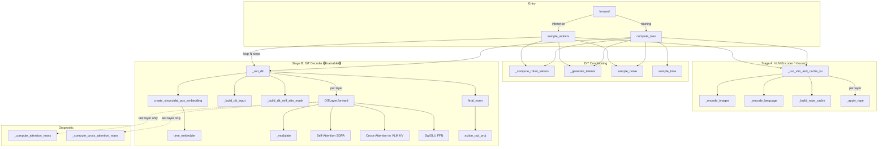

# WilroTransformer — Methods Calling Chain

> Auto-generated from `src/models/wilro/wilro_model.py`

---

## Overview

`WilroTransformer` is an encoder-decoder flow matching VLA with two main execution paths:

| Path | Entry Point | Purpose |
|------|-------------|---------|
| **Training** | `forward()` → `compute_loss()` | Flow-matching loss + optional contrastive language loss |
| **Inference** | `forward()` → `sample_actions()` | Euler-integration denoising over N steps |

Both paths share the **Stage A** VLM encoder (`_run_vlm_and_cache_kv`) which runs **once**, and the **Stage B** DiT decoder (`_run_dit`) which runs **once per training step** or **N times per inference**.

---

## 1. Training Call Chain

```
forward(batch)
  │
  └── compute_loss(batch)
        │
        ├── _run_vlm_and_cache_kv(batch)  ────────────────────── Stage A (once, frozen, @no_grad)
        │     ├── _encode_images(batch, B)
        │     │     └── self.vision_model(pixel_values=img)
        │     │         self.connector(vis_hidden)
        │     │
        │     ├── _encode_language(batch, device)
        │     │     ├── self.processor.tokenizer(descs)
        │     │     └── self.text_model.get_input_embeddings()(input_ids)
        │     │
        │     ├── _build_rope_cache(seq_len, head_dim, rope_theta, ...)
        │     │
        │     └── FOR i, layer IN enumerate(text_model.layers):
        │           ├── layer.input_layernorm(hidden)
        │           ├── layer.self_attn.q_proj / k_proj / v_proj
        │           ├── _apply_rope(Q, K, cos, sin)
        │           ├── (if i >= capture_start) → capture (K, V) into kv_cache
        │           ├── F.scaled_dot_product_attention(Q, K, V, mask)
        │           ├── layer.self_attn.o_proj
        │           ├── layer.post_attention_layernorm
        │           └── layer.mlp
        │
        ├── _compute_robot_tokens(batch)
        │     └── self.robot_visual_encoder(img)    (optional, if use_robot_cnn)
        │
        ├── _generate_latents(batch, B, device, dtype)
        │     ├── _encode_language(batch, device)   (reused for pooled lang embedding)
        │     └── self.latent_generator(pooled)
        │
        ├── sample_noise(actions.shape, device)
        │
        ├── sample_time(B, device)
        │
        ├── _run_dit(batch, x_t, t, kv_cache, vlm_kv_pad_mask, ...)  ── Stage B
        │     ├── create_sinusoidal_pos_embedding(timesteps, hidden_size)
        │     ├── self.time_embedder(t_emb_raw)
        │     │
        │     ├── _build_dit_input(batch, noisy_actions, robot_tokens, latents, action_prefix)
        │     │     ├── self.sink_token.expand()
        │     │     ├── self.state_encoder(state)
        │     │     └── self.action_in_proj(noisy_actions) + self.action_pos_emb
        │     │
        │     ├── _build_dit_self_attn_mask(L_dit, action_start_idx, ...)
        │     │
        │     └── FOR i, layer IN enumerate(dit_layers):
        │           ├── [diagnostic] _compute_attention_mass(x, t_emb, mask, regions)
        │           ├── [diagnostic] _compute_cross_attention_mass(x, t_emb, ...)
        │           └── layer.forward(x, t_emb, vlm_k, vlm_v, vlm_kv_pad_mask, self_attn_mask)
        │                 │
        │                 ├── self.adaLN_modulation(t_emb) → 9× shift/scale/gate
        │                 │
        │                 ├── ── SELF-ATTENTION ──
        │                 │     ├── _modulate(self.sa_norm(x), s_sa, sc_sa)
        │                 │     ├── self.sa_q / sa_k / sa_v
        │                 │     ├── (GQA repeat if num_kv_heads ≠ num_heads)
        │                 │     ├── F.scaled_dot_product_attention(Q, K, V, mask)
        │                 │     ├── self.sa_o + self.sa_drop
        │                 │     └── x = x + g_sa * sa_out
        │                 │
        │                 ├── ── CROSS-ATTENTION (to VLM KV) ──
        │                 │     ├── _modulate(self.ca_norm(x), s_ca, sc_ca)
        │                 │     ├── self.ca_q
        │                 │     ├── (GQA repeat on frozen vlm_k, vlm_v)
        │                 │     ├── (build padding mask from vlm_kv_pad_mask)
        │                 │     ├── F.scaled_dot_product_attention(Q, Kv, Vv, ca_mask)
        │                 │     ├── self.ca_o + self.ca_drop
        │                 │     └── x = x + g_ca * ca_out
        │                 │
        │                 └── ── SwiGLU FFN ──
        │                       ├── _modulate(self.ffn_norm(x), s_ff, sc_ff)
        │                       ├── self.ffn (SwiGLU)
        │                       ├── self.ffn_drop
        │                       └── x = x + g_ff * ff_out
        │
        ├── self.final_norm(action_tokens)
        ├── self.action_out_proj → v_t (velocity prediction)
        │
        ├── F.mse_loss(v_t, u_t) → main_loss
        │
        └── [if contrastive_loss_weight > 0 and training]
              ├── permute language portion of kv_cache across batch
              ├── _run_dit(...) with shuffled_cache → v_wrong
              └── hinge loss: main_loss += contrastive_w * loss_contrastive
```

---

## 2. Inference Call Chain

```
forward(batch)
  │
  └── sample_actions(batch)    (@torch.no_grad)
        │
        ├── _run_vlm_and_cache_kv(batch)          ── Stage A (same as training)
        │
        ├── _compute_robot_tokens(batch)
        │
        ├── _generate_latents(batch, B, device, dtype)
        │
        ├── sample_noise((B, horizon, action_dim), device)
        │
        └── FOR step IN range(num_inference_steps):    (default N=10)
              │
              ├── _run_dit(batch, x_t, t, kv_cache, ...)  ── Stage B
              │     (same call chain as training, but action_prefix=None)
              │
              ├── x_t = x_t + dt * v_t      (Euler step, dt = -1/N)
              └── t = t + dt
                    │
                    └── return x_t[:, :n_action_steps]
```

---

## 3. Helper / Utility Functions

These are standalone module-level functions called from within the class methods:

```
create_sinusoidal_pos_embedding(time, dimension)
  ├── Called by: _run_dit() → time embedding
  └── Returns: (B, hidden_size) sinusoidal time features

_build_rope_cache(seq_len, head_dim, base, device, dtype)
  ├── Called by: _run_vlm_and_cache_kv() → RoPE for VLM
  └── Returns: (cos, sin) each (1, seq_len, head_dim)

_apply_rope(q, k, cos, sin)
  ├── Called by: _run_vlm_and_cache_kv() → per-layer RoPE rotation
  └── Returns: (q_rot, k_rot)

_modulate(x, shift, scale)
  ├── Called by: DiTLayer.forward() → adaLN-Zero modulation (×3 per layer)
  └── Returns: x * (1 + scale) + shift
```

---

## 4. Mermaid Flowchart



---

## 5. Quick Reference: Method-by-Method Summary

| Method | Called From | Role |
|--------|-------------|------|
| `forward()` | External / trainer | Dispatch: training → `compute_loss`, inference → `sample_actions` |
| `compute_loss()` | `forward()` | Full training step: VLM encode + DiT decode + flow-matching loss |
| `sample_actions()` | `forward()` | Euler denoising over N steps |
| `_run_vlm_and_cache_kv()` | `compute_loss`, `sample_actions` | Run frozen VLM, capture last-N-layer KV caches |
| `_encode_images()` | `_run_vlm_and_cache_kv` | Vision model + connector forward pass |
| `_encode_language()` | `_run_vlm_and_cache_kv`, `_generate_latents` | Tokenize + embed language instructions |
| `_compute_robot_tokens()` | `compute_loss`, `sample_actions` | Robot CNN visual encoder (optional) |
| `_generate_latents()` | `compute_loss`, `sample_actions` | Pool language → latent thought tokens |
| `_run_dit()` | `compute_loss`, `sample_actions` | Full DiT decoder forward (N layers) |
| `_build_dit_input()` | `_run_dit` | Assemble DiT sequence: [SINK, latent, state, prefix, robot, action] |
| `_build_dit_self_attn_mask()` | `_run_dit` | Causal + optional Λ-mask for action prefix |
| `_compute_attention_mass()` | `_run_dit` (diagnostic) | Self-attention mass per region from action queries |
| `_compute_cross_attention_mass()` | `_run_dit` (diagnostic) | Cross-attention mass to vision vs language from action queries |
| `sample_noise()` | `compute_loss`, `sample_actions` | Temporally-correlated Gaussian noise |
| `sample_time()` | `compute_loss` | Uniform time sampling for flow matching |
| `count_parameters()` | External | Trainable vs frozen parameter counts |
| `gradient_checkpointing_enable/disable()` | External | Toggle DiT activation recomputation |
| `train()` | External | Override to keep VLM in eval mode |

| Module-Level Function | Called From | Role |
|-----------------------|-------------|------|
| `create_sinusoidal_pos_embedding()` | `_run_dit` | Flow-matching time → sinusoidal features |
| `_build_rope_cache()` | `_run_vlm_and_cache_kv` | Llama-style RoPE cos/sin tables |
| `_apply_rope()` | `_run_vlm_and_cache_kv` | Apply RoPE to Q, K |
| `_modulate()` | `DiTLayer.forward` | adaLN-Zero: `x * (1 + scale) + shift` |