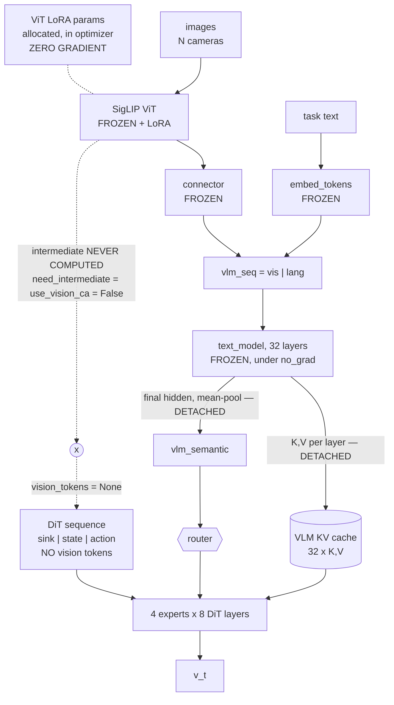
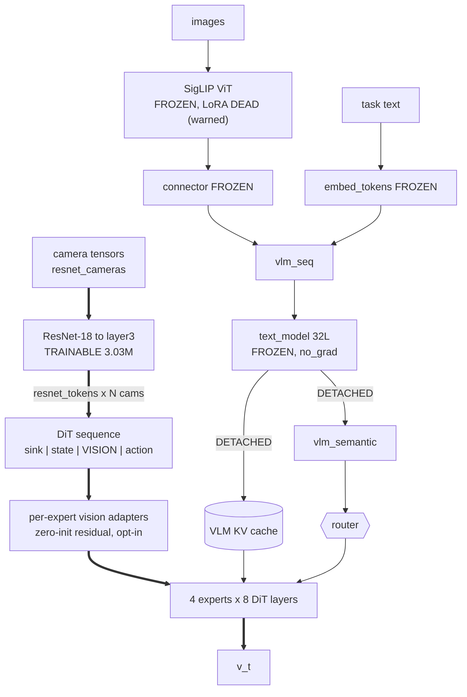
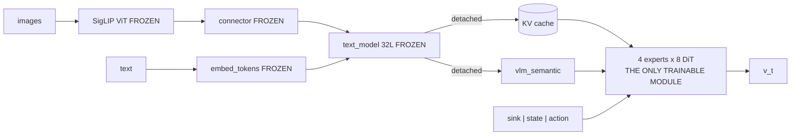
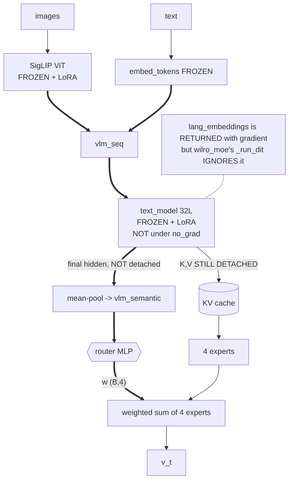
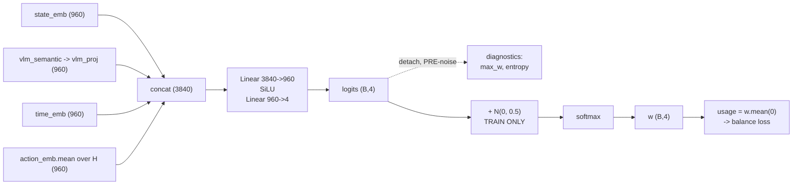
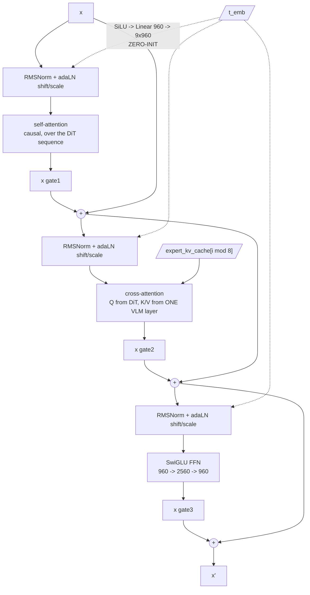

# WILRO-MoE Architecture

`wiltechs_moe` with the backbone swapped from Qwen3-VL-4B to SmolVLM2-500M.
Equivalently: **wilro's encoder under wiltechs_moe's decoder.** The encoder half
is *imported* (`SmolVLMEncoderMixin`), not copied.

- **Encoder** = SmolVLM2-500M (SigLIP ViT + connector + 32-layer text stack).
  Runs **once per observation**. Emits a post-RoPE K/V cache for **all 32 text
  layers**, the mean-pooled final hidden state (for the router), and — *in some
  configurations only* — spatial vision tokens for the sequence.
- **Decoder** = **4 experts × 8 DiT layers**, reading **disjoint** bands of those
  32 layers. Every expert runs on every forward; a softmax router weights them.
  Runs **N times per observation** during the flow-matching loop.

4 × 8 = 32 = exactly SmolVLM2's text depth, so the partition is exact.

> `dit_hidden_size` defaults to **960 = the VLM's hidden size**, which lets the
> experts reuse wilro's `DiTLayer` verbatim (one head geometry — 15 heads / 5 KV
> heads / head_dim 64 — for both self- and cross-attention). A narrower expert
> needs the split `sa_`/`ca_` variant from `wiltechs_vla`, which is **not
> ported**: the constructor raises rather than mis-shaping cross-attention.

---

## Read this table before any diagram

The configurations below differ in exactly one thing that matters — **where
gradient can reach**. Two facts fix the whole picture:

| | |
|---|---|
| `smolvlm_encoder.py:524` | the KV cache is **always** `.detach()`ed — cross-attention **never** backprops into the VLM, in any config |
| `smolvlm_encoder.py:501` | the text stack runs under `no_grad` **unless text LoRA is on** |

So the encoder has only two possible gradient inlets: **vision tokens injected
into the DiT sequence**, and **the pooled hidden state feeding the router**.

| config | vision tokens in sequence | ViT LoRA | text LoRA | trainable in encoder |
|---|---|---|---|---|
| **A** `vlm` + ViT LoRA *(default)* | **NONE** ⚠ | **DEAD, silently** | off | **nothing** |
| **B** `resnet` **← the 79.5% run** | ResNet-18, 100×2 = 200 tok | n/a (set to 0) | off | ResNet-18, 3.03M |
| **C** no LoRA at all | NONE | — | — | nothing (honest) |
| **D** `vlm` + text LoRA | NONE | via router only | trains via router | text LoRA |

**A and C are the same computation.** A just also allocates ViT LoRA parameters,
puts them in the optimizer, and never updates them. See
[The default config's dead pathways](#the-default-configs-dead-pathways).

---

## Config A — default (`vision_token_source="vlm"`, ViT LoRA on, text LoRA off)

**No run has used this.** It is the default a fresh `--` invocation lands on, and
it is the one with two dead pathways. The 17k / 79.5% checkpoint is **config B**.



**Every arrow leaving the encoder is detached.** The experts reach vision only
through cross-attention to the KV cache — which does cover the vision token
positions, since `vlm_seq = [vis_tokens, lang_tokens]`. The model is not blind;
it simply has **one** visual pathway where the docstrings describe two.

---

## Config B — `vision_token_source="resnet"`

The only configuration with a *trainable* visual encoder. This is the shape of
the 2026-06-21 architecture that scored 82.5 on wilro, and **it is what the
17k checkpoint that scored 79.5% spatial actually ran**: `resnet_tokens 100`
x 2 cameras @ 224px = **200 sequence vision tokens**, with
`vision_lora_num_layers: 0` and `text_lora_num_layers: 0`, so the SmolVLM2
encoder is entirely frozen and the ResNet-18 is the only trainable visual
parameter. Sequence length `1 + 1 + 200 + 64 = 266`, against `66` under config A.



Double lines = the gradient-carrying path. `RobotVisualEncoder` is truncated
after `layer3` (layer4 is 72% of stock ResNet-18 and is excluded), hence 3.03M.

> Selecting `resnet` prints a `[WARN]` that the ViT LoRA will not train. That
> warning is **correct but incomplete** — the same is true under config A, where
> nothing is printed.

---

## Config C — no LoRA anywhere



The encoder is a pure frozen feature extractor: one VLM forward per observation
produces a fixed 32-layer KV cache and one pooled vector, and **646M of decoder
is the entire trainable model.** Computationally identical to config A.

---

## Config D — text LoRA on (`text_lora_num_layers > 0`)

The only `vlm`-source config where any encoder gradient exists — and the path is
unusual enough to be worth its own diagram.



**In wilro this is not how text LoRA trains.** wilro injects `lang_embeddings`
into the DiT sequence, giving a short, direct path. wilro_moe's `_run_dit`
accepts and ignores `lang_tokens` — it reaches language through the experts'
cross-attention to the KV instead. So here the *entire* encoder gradient is
squeezed through a **4-way softmax router**. That is a very thin channel to
train a LoRA with, and no run has used it. (wilro's own branch also records text
LoRA causing NaN, which is why the KV is unconditionally detached.)

---

## Expert ↔ VLM layer bands

Bands are **disjoint and contiguous, shallow experts on shallow layers**:

| Expert | VLM text layers | reads |
|---|---|---|
| 0 | 0–7 | early / lexical |
| 1 | 8–15 | |
| 2 | 16–23 | |
| 3 | 24–31 | late / semantic |

Expert `e`'s DiT layer `i` cross-attends to `expert_kv_blocks[e][i % 8]`, i.e. a
1:1 pairing of the expert's 8 layers to its 8 captured VLM layers.

> **Why the mixin must capture ALL layers.** `expert_kv_blocks` indexes
> `kv_cache[i]` by absolute VLM layer number. The mixin appends in layer order,
> so a *partial* capture would silently renumber every band — expert 3 would
> read early layers while the config still said 24–31. This is why
> `capture = list(range(32))` rather than a subset, and why
> `vlm_capture_layers` must be divisible by `num_experts`.

> **Why 4 × 8 and not wiltechs_moe's 4 × 9.** SmolVLM2-500M has **32** text
> layers where Qwen3-VL-4B has 36. With disjoint bands, 36 does not fit; the
> constructor raises rather than overlapping them. `train_wilro_moe.py` carries
> a preflight guard for the same reason.

---

## The router



Four inputs, chosen so the router sees **the whole conditioning**: the robot
state, the fused multimodal context, where in the flow it is, and what the
current noisy action looks like.

`vlm_semantic` is the mean-pooled **final hidden state**, not the KV cache's V —
hidden is always `hidden_size`, so there is no GQA head-count mismatch to
unpick. Vision and language are already fused by the text stack's causal
attention, so one pool of the last layer carries both.

| knob | default | note |
|---|---|---|
| `num_experts` | 4 | |
| `expert_num_layers` | 8 | 4 × 8 = 32 = VLM depth |
| `router_temperature` | 1.0 | |
| `router_top_k` | **0** | 0 = **dense**: all experts run, see cost note |
| `router_balance_weight` | 0.1 | CV² of usage |

### Three things about the router that are load-bearing

1. **Init is `normal_(std=0.02)`, deliberately not zeros.** Zero init makes every
   logit identical at step 0; any tiny data gradient tips one expert ahead and
   the softmax positive-feedback loop collapses to it. Observed on the sibling:
   E3 at 100% by step 200.

2. **Train-time exploration noise is fixed `N(0, 0.5)`, not scaled to the logit
   magnitude** — so it keeps feeding starved experts signal instead of washing
   out as the router grows confident. Consequence: **diagnostics must read the
   pre-noise weights.** A router with no input dependence at all still reports
   `max_w ≈ 0.39` once the noise is added, not the 0.25 that "uniform" suggests.

3. **The balance loss is applied in the *policy's* `forward`, not in
   `compute_loss`** — it reads `model._last_router_usage` *after* `compute_loss`
   returns. That is why `_run_dit` takes `record=True/False`: see Failure modes.

### Cost note: `router_top_k=0` means this is a DENSE mixture

Every expert runs on every token of every forward. **There is no compute saving
from the MoE structure** — 4 experts × 8 layers costs the same as one 32-layer
decoder. What the structure buys is *specialisation over disjoint VLM depth
bands* plus a router that can weight them per-sample. Setting `router_top_k > 0`
would make it sparse, but no run has used it.

---

## Sequence layout

```
index:   0        1 .. S      S+1 .. S+V         S+V+1 .. S+V+H
       [ sink ] [ state ] [ vision tokens ] [ noisy actions x_t ]
                          ^ PRESENT ONLY    ^ action_start_idx
                            IN CONFIG B
```

with a **causal** mask over the whole thing. `S` is 1 unless
`use_state_history`; `H = horizon`.

**`V = 0` in configs A, C and D** — see the table at the top. Only the ResNet
source produces sequence vision tokens today.

When they *are* present, they sit **before** the actions because there is no
Vision CA sublayer: causal self-attention is the only path from an action query
to a vision token, so put them after and the mask hides them completely.

> wiltechs_moe additionally places K "thought" tokens here, from a QFormer over
> the deepest VLM layer's KV. **Dropped 2026-09-05** (18.4M params + a sequence
> region) after being reported as not earning its keep there. No wilro_moe
> checkpoint existed yet, which is the only reason this is a deletion rather
> than a default-off flag.

---

## One DiT layer

wilro's `DiTLayer`, constructed with `use_vision_ca=False` — matching
wiltechs_moe. **Three sublayers, not four**, so adaLN-Zero produces 9 modulation
vectors rather than 12.



**adaLN-Zero means every residual branch starts at exactly zero, so at init each
expert *is* the identity map.** This is why the expert-disagreement diagnostic
reads exactly `0.000` at step 0 — "not yet differentiated", which is
indistinguishable from "in agreement" by the number alone. Read it with the step
count.

---

## Per-expert vision adapters (`resnet_expert_adapter_dim`, default 0 = off)

All four experts read the **same** vision tokens. If different experts want
different things from them, they have no way to say so — the tokens are shared
and frozen relative to the expert stack. This is the fix:

```python
vis   = seq[:, lo:hi]
delta = expert_vision_gates[e] * expert_vision_adapters[e](vis)
seq_e = cat([seq[:, :lo], vis + delta, seq[:, hi:]], dim=1)
```

One `RMSNorm → Linear(960,d) → SiLU → Linear(d,960)` MLP per expert, **zero-init
output over a residual**, plus a scalar gate initialised to 0. So an adapter that
never trains is the identity map rather than noise — which matters precisely for
an expert the router has starved, since that is the one whose adapter gets no
gradient. At `d=256` this is 0.49M × 4 = **1.98M**, ~0.3% of the decoder.

> **Inert in configs A / C / D.** The adapter is applied under `if self.expert_vision_adapters is not None and hi > lo`, and `hi == lo` whenever there are no sequence vision tokens. Turning `resnet_expert_adapter_dim` on without `vision_token_source="resnet"` allocates 1.98M that never runs.

---

## Parameter budget

Per DiT layer at `hidden=960`, `intermediate=2560`, 15 heads / 5 KV heads / head_dim 64:

| component | params | share |
|---|---|---|
| self-attention | 2.46M | 12.3% |
| VLM-KV cross-attention | 1.84M | 9.2% |
| SwiGLU FFN | 7.37M | 36.9% |
| **adaLN-Zero (9 vectors)** | **8.30M** | **41.6%** |
| RMSNorms | ~0.003M | 0.0% |
| **per layer** | **19.98M** | |

```
1 expert   =  8 layers          =  159.8M
4 experts                       =  639.3M
router                          =    4.61M
sink / state / action / t emb   =    1.93M
------------------------------------------
TRAINABLE (adapters off, LoRA off) ≈ 646M
```

**adaLN-Zero is the single largest block in the decoder — larger than the FFN.**
Each layer carries a `Linear(960, 9×960)` producing per-sample modulation from
`t_emb`. That is the price of making the whole stack time-conditioned.

Encoder params are frozen and do not appear above; vision/text LoRA adds ~2.4M at
rank 64 (SmolVLM2's ViT has 12 layers, so `vision_lora_num_layers > 12` clamps).

> **Optimizer memory follows from this:** Adam holds two fp32 moments per
> trainable parameter, ≈ 2 × 646M × 4 B = **5.2 GB**. This is why the resume path
> must stage the checkpoint and the optimizer state on **CPU** — loading either
> straight to the GPU transiently doubles it.

---

## Flow matching

Identical to wilro; the MoE changes only what computes `v_t`.

| | |
|---|---|
| convention | `x_t = t·noise + (1−t)·a`, target `u_t = noise − a`. **t=1 is noise, t=0 is data.** |
| t sampling | `uniform` (default) or `lognormal` (SD3 logit-normal, `mean −0.5`, `std 1.0`) |
| solver | explicit Euler, **uniform grid**, `dt = −1/N`, starting at `t=1.0`; `N = num_inference_steps` (default 10) |
| execution | `select_action` commits `n_action_steps` then re-samples — **each re-sample draws fresh noise** |

Loss reweighting carried over from wilro: `action_dim_weights`,
`future_steps_weight` past `n_action_steps`, `pos_decay_lambda`,
`gripper_phase_weight` around gripper transitions, and padding masks — all folded
into the **denominator** too, so the loss stays a weighted *mean* and the
effective LR is unchanged.

### Contrastive language loss (`contrastive_loss_weight`, default 0.1)

Permutes only the **language band** `[L_vis : L_vis+L_lang]` of the cached KV
across the batch and re-runs the DiT — no second VLM forward. The wrong-language
prediction is a **detached** negative target, and the second DiT forward runs
under `no_grad`, which avoids storing a full second backward graph (~2× memory).

---

## The default config's dead pathways

Found 2026-09-07 while separating the diagrams above. **Not fixed** — recorded
first, because fixing it changes the model's forward and would break comparison
against the 17k checkpoint.

The chain, all four links verified in the source:

```
wilro_moe_model.py:258   self.use_vision_ca = False                 (hardcoded)
smolvlm_encoder.py:438   need_intermediate = self.use_vision_ca and (src != "resnet")
                         -> False
                         -> _encode_images(..., return_intermediate=False)
                         -> intermediate_features = None
smolvlm_encoder.py:650   elif vlm_robot_features is None: return None
                         -> _compute_vision_tokens returns None
_build_expert_input      -> seq = [sink, state, action], vis_lo == vis_hi
```

### Consequence 1 — the sequence has no vision tokens

`_build_expert_input`'s docstring says "vision tokens go BEFORE the action
tokens because ... causal self-attention is the only path from an action query
to them", and `wilro_moe_model.py:278` prints
`[wilro_moe] vision tokens: SigLIP intermediate layer -3` at startup. **The log
claims they exist; at runtime they are `None`.**

The model is *not* blind — `vlm_seq = [vis_tokens, lang_tokens]`, so the KV
cache the experts cross-attend to does cover the vision positions. But the
second visual pathway the design describes is absent, and the per-expert vision
adapters are skipped with it.

### Consequence 2 — the ViT LoRA has no gradient, silently

The only two inlets to the ViT LoRA are the sequence injection (now `None`) and
the text stack (`no_grad` unless text LoRA is on). The KV is unconditionally
detached. So under the default config the adapters are **allocated, placed in
the optimizer, and never updated.**

`vision_token_source="resnet"` prints a `[WARN]` for exactly this. The default
path prints nothing — and it is the path every run has taken.

### What this does NOT explain

wilro_moe still reached **79.5% spatial at 17k**, the best number in the family.
So the missing pathway is not load-bearing for that result, and "fix it and the
number goes up" is a hypothesis, not a conclusion. Fixing it is a **new
architecture**, not a bug fix, and needs its own A/B.

---

## Failure modes already hit

Recording these because both were **silent** — the loss curve looked normal.

### 1. The router balance penalty carried no gradient at all

The contrastive negative's `_run_dit` runs *after* the real one, under
`no_grad`. Without a guard it **overwrote `_last_router_usage` with a
graph-detached tensor.** The balance penalty — which is applied later, in the
policy's `forward` — then added a *constant* to the loss, contributing exactly
zero gradient.

Measured consequence: **router collapsed to E3 = 100% by step 200**, CV² = 3.0
(the max for 4 experts), entropy 0.000, `Router - Avg Abs Grad: 0.000000`.

Fix: `_run_dit(..., record=False)` at the contrastive call site. Verified after:
`balance.requires_grad=True, grad_fn=DivBackward0`, router-head gradient from the
balance term alone `max|g| = 4.8e-01`.

### 2. `.6f` floored the gradient readout to `0.000000`

On a 646M-parameter average, `{grad:.6f}` prints `0.000000` for a perfectly
healthy gradient — which reads as *exactly* the failure above. Both trainers now
print `{grad:.3e}`.

---

## Differences from the two siblings

### vs `wiltechs_moe` (Qwen3-VL-4B)

| | wiltechs_moe | **wilro_moe** |
|---|---|---|
| backbone | Qwen3-VL-4B | **SmolVLM2-500M** |
| experts × layers | 4 × 9 = 36 | **4 × 8 = 32** (SmolVLM2 has 32 text layers) |
| `dit_hidden` | 1280 (≠ VLM hidden) | **960 (= VLM hidden)** → wilro's `DiTLayer` reused verbatim |
| thought QFormer | yes (18.4M) | **removed** |
| per-expert vision adapters | no | **yes** (opt-in) |

Nothing here imports from `wiltechs_moe`: that module pulls in
`Qwen3VLForConditionalGeneration` at import time, which `cac2de6` had to cut out
of the eval harness. `MoERouter` is reproduced with its reasoning intact.

### vs `wilro`

| | wilro | **wilro_moe** |
|---|---|---|
| decoder | one stack of `num_dit_layers` | **4 experts, disjoint VLM KV bands** |
| Vision CA sublayer | selectable (`use_vision_ca`) | **always off** — vision lives in the sequence |
| DiT layer sublayers | 3 or 4 (adaLN 9 or 12 vec) | **3 (adaLN 9 vec)** |
| latent / thought tokens | latent path exists | **`num_latent_tokens = 0`** |
| async action prefix | supported | **accepted and ignored** |
| encoder | `SmolVLMEncoderMixin` | **same mixin, shared code** |

`_run_dit` keeps wilro's exact signature so the loss and sampling code lifted
from it works unchanged; `latents`, `action_prefix` and `lang_tokens` are
accepted and ignored.

---

## Config quick reference

| field | default | |
|---|---|---|
| `num_experts` | 4 | |
| `expert_num_layers` | 8 | must satisfy `n × depth ≤ 32` |
| `vlm_capture_layers` | `[]` | empty ⇒ all 32; must be divisible by `num_experts` |
| `dit_hidden_size` | 960 | **must equal the VLM hidden** (else `NotImplementedError`) |
| `router_temperature` | 1.0 | |
| `router_top_k` | 0 | 0 = dense |
| `router_balance_weight` | 0.1 | CV² of usage; applied in the policy |
| `resnet_expert_adapter_dim` | 0 | 0 = off |
| `vision_token_source` | `"vlm"` | `"vlm"` (SigLIP layer `-3`) or `"resnet"` |
| `contrastive_loss_weight` | 0.1 | |
| `num_inference_steps` | 10 | |
| `state_dim` / `action_dim` | 7 / 7 | |

> `vision_token_source="resnet"` **severs the only gradient path to the ViT
> LoRA** (the text stack runs under `no_grad` and the KV cache is detached). The
> constructor prints a `[WARN]`; pass `--vision_lora_num_layers 0` to say so in
> the config rather than carrying adapters that never train.

Legacy 2026-06/07 field names (`robot_ca_source`, `use_robot_ca`,
`robot_encoder_*`, `robot_cnn_*`) are accepted and **mirrored** — see wilro's
[ARCHITECTURE.md § Naming](../wilro/ARCHITECTURE.md) and
`src/migrate_wilro_config.py`.
