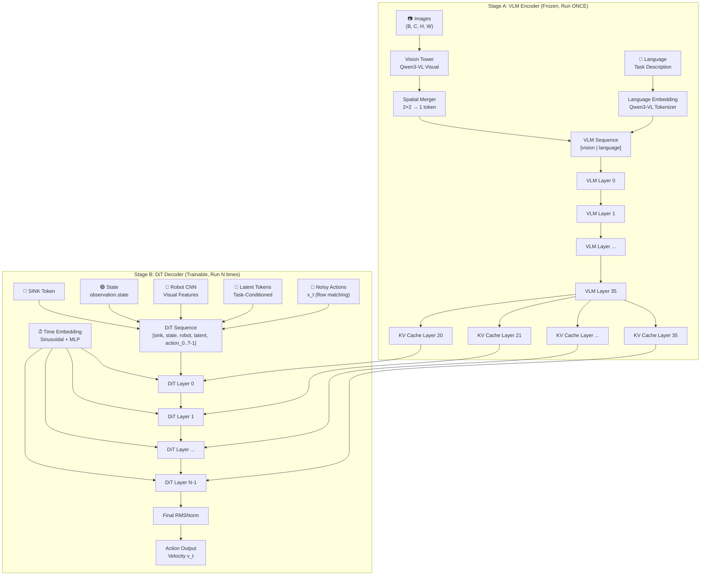

# WiltechsVLA Architecture

## Overview

WiltechsVLA is a **Qwen3-VL-based encoder-decoder flow matching policy** following the Xiaomi-Robotics-0 / pi0-style Mixture-of-Transformers (MoT) architecture. It uses a **frozen Qwen3-VL-4B** as the vision-language encoder and a **trainable DiT (Diffusion Transformer) decoder** for action prediction.

---

## High-Level Architecture



---

## Detailed Data Flow

```
┌─────────────────────────────────────────────────────────────────────────┐
│                        INPUT BATCH                                     │
│  ┌──────────────┐  ┌──────────────────┐  ┌──────────────────────────┐  │
│  │ Images       │  │ Task Description │  │ observation.state        │  │
│  │ (B,C,H,W)    │  │ (text string)    │  │ (B, state_dim)           │  │
│  │ per camera   │  │                  │  │                          │  │
│  └──────┬───────┘  └────────┬─────────┘  └───────────┬──────────────┘  │
└─────────┼───────────────────┼────────────────────────┼─────────────────┘
          │                   │                        │
          ▼                   ▼                        ▼
┌─────────────────────────────────────────────────────────────────────────┐
│              STAGE A: VLM ENCODER (FROZEN, @torch.no_grad)             │
│                    Run ONCE per inference step                          │
│                                                                         │
│  ┌─────────────────────┐     ┌─────────────────────┐                   │
│  │  Vision Tower       │     │  Language Embedding │                   │
│  │  Qwen3-VL Visual    │     │  Tokenizer + Embed  │                   │
│  │  → spatial merger   │     │  (max 48 tokens)    │                   │
│  └──────────┬──────────┘     └──────────┬──────────┘                   │
│             │                           │                               │
│             └───────────┬───────────────┘                               │
│                         ▼                                               │
│              ┌─────────────────────┐                                    │
│              │  VLM Sequence       │                                    │
│              │  [vision | language]│                                    │
│              │  (B, L_vlm, 2560)   │                                    │
│              └──────────┬──────────┘                                    │
│                         │                                               │
│  ┌──────────────────────────────────────────────────────────┐          │
│  │  Qwen3-VL Text Layers (ALL 36 layers, frozen)            │          │
│  │                                                           │          │
│  │  Layer 0 → Layer 1 → ... → Layer 19 → Layer 20 → ... → 35│          │
│  │                                        │                  │          │
│  │                    ┌───────────────────┘                  │          │
│  │                    ▼                                       │          │
│  │     Capture KV from last N layers                         │          │
│  │     (num_dit_layers, default 16)                          │          │
│  │                                                           │          │
│  │     KV Cache: [(K_20,V_20), (K_21,V_21), ..., (K_35,V_35)]│         │
│  │     Each: (B, num_kv_heads, L_vlm, head_dim)              │          │
│  │     K is post-M-RoPE rotation                              │         │
│  └───────────────────────────────────────────────────────────┘          │
│                         │                                               │
│                         ▼                                               │
│              ┌─────────────────────┐                                    │
│              │  vlm_kv_pad_mask    │                                    │
│              │  (B, L_vlm) bool    │                                    │
│              │  True = valid pos   │                                    │
│              └─────────────────────┘                                    │
└─────────────────────────┬───────────────────────────────────────────────┘
                          │
                          ▼
┌─────────────────────────────────────────────────────────────────────────┐
│              STAGE B: DiT DECODER (TRAINABLE)                          │
│              Run num_inference_steps times (default: 5)                 │
│                                                                         │
│  ┌──────────────────────────────────────────────────────────────┐      │
│  │  DiT Input Assembly                                         │      │
│  │                                                              │      │
│  │  ┌──────┐  ┌───────┐  ┌───────────┐  ┌──────────┐  ┌──────┐│      │
│  │  │ SINK │  │ State │  │ Robot CNN │  │ Latents  │  │Action││      │
│  │  │ (1)  │  │  (1)  │  │ (per cam) │  │ (8 toks) │  │ (H)  ││      │
│  │  └──┬───┘  └───┬───┘  └─────┬─────┘  └────┬─────┘  └──┬───┘│      │
│  │     └──────────┴────────────┴──────────────┴───────────┘    │      │
│  │                         │                                    │      │
│  │              ┌──────────▼──────────┐                         │      │
│  │              │  DiT Sequence       │                         │      │
│  │              │  (B, L_dit, H_dit)  │                         │      │
│  │              └─────────────────────┘                         │      │
│  └──────────────────────────────────────────────────────────────┘      │
│                                                                         │
│  ┌──────────────────────────────────────────────────────────────┐      │
│  │  Time Embedding                                              │      │
│  │  t → Sinusoidal(dit_hidden) → MLP → t_emb (B, dit_hidden)   │      │
│  │  → fed to every DiT layer's adaLN-Zero                       │      │
│  └──────────────────────────────────────────────────────────────┘      │
│                                                                         │
│  ┌──────────────────────────────────────────────────────────────┐      │
│  │  DiT Layer i (repeated num_dit_layers times)                │      │
│  │                                                              │      │
│  │  Input: x (B, L_dit, H_dit)                                 │      │
│  │                                                              │      │
│  │  ┌─────────────────────────────────────────────────────┐    │      │
│  │  │  1. Self-Attention (causal mask over DiT sequence)  │    │      │
│  │  │     h = _modulate(sa_norm(x), shift_sa, scale_sa)   │    │      │
│  │  │     Q,K,V = sa_q(h), sa_k(h), sa_v(h)               │    │      │
│  │  │     sa = SDPA(Q, K, V, causal_mask)                 │    │      │
│  │  │     x = x + gate_sa * sa_o(sa)                      │    │      │
│  │  └─────────────────────────────────────────────────────┘    │      │
│  │                         │                                    │      │
│  │  ┌─────────────────────────────────────────────────────┐    │      │
│  │  │  2. Cross-Attention (to VLM KV cache layer i)       │    │      │
│  │  │     h = _modulate(ca_norm(x), shift_ca, scale_ca)   │    │      │
│  │  │     Q = ca_q(h)  [projects DiT→VLM head dim]        │    │      │
│  │  │     K,V = kv_cache[i]  [frozen VLM]                 │    │      │
│  │  │     ca = SDPA(Q, K, V, pad_mask)                    │    │      │
│  │  │     x = x + gate_ca * ca_o(ca)                      │    │      │
│  │  └─────────────────────────────────────────────────────┘    │      │
│  │                         │                                    │      │
│  │  ┌─────────────────────────────────────────────────────┐    │      │
│  │  │  3. FFN (SwiGLU)                                    │    │      │
│  │  │     h = _modulate(ffn_norm(x), shift_ff, scale_ff)  │    │      │
│  │  │     ff = SwiGLU(h)                                  │    │      │
│  │  │     x = x + gate_ff * ff                            │    │      │
│  │  └─────────────────────────────────────────────────────┘    │      │
│  │                         │                                    │      │
│  │  adaLN-Zero: t_emb → SiLU → Linear(9*H) →                  │      │
│  │              {shift, scale, gate} × 3 sublayers             │      │
│  └──────────────────────────────────────────────────────────────┘      │
│                         │                                               │
│              ┌──────────▼──────────┐                                    │
│              │  Final RMSNorm      │                                    │
│              │  (on action slice)  │                                    │
│              └──────────┬──────────┘                                    │
│                         │                                               │
│              ┌──────────▼──────────┐                                    │
│              │  Action Out Proj    │                                    │
│              │  Linear(H→action_dim)│                                   │
│              │  (zero-init)        │                                    │
│              └──────────┬──────────┘                                    │
│                         │                                               │
│                         ▼                                               │
│              ┌─────────────────────┐                                    │
│              │  Velocity v_t       │                                    │
│              │  (B, H, action_dim) │                                    │
│              └─────────────────────┘                                    │
└─────────────────────────────────────────────────────────────────────────┘
```

---

## Key Components

### 1. VLM Encoder (Frozen)

| Component | Details |
|-----------|---------|
| **Model** | Qwen3-VL-4B-Instruct |
| **Layers** | All 36 text layers (no truncation) |
| **Hidden Size** | 2560 |
| **Attention Heads** | 32 heads, **8 KV heads** (GQA, ratio 4:1) |
| **Head Dim** | **128** (2560 / 32 = 80 is wrong; Qwen3-VL uses explicit head_dim=128) |
| **Intermediate FFN** | 9728 |
| **Vision** | Dynamic resolution, spatial_merge_size=2 |
| **Position Encoding** | M-RoPE (3D: t, h, w for vision; monotonic for language) |
| **KV Capture** | Last `num_dit_layers` layers (default: layers 20-35, 16 layers) |
| **KV Geometry** | Each KV: (B, 8, L_vlm, 128) — 8 KV heads, head_dim 128 |

### 2. DiT Decoder (Trainable)

| Component | Details |
|-----------|---------|
| **Layers** | `num_dit_layers` (default: 16) |
| **Hidden Size** | `dit_hidden_size` — **1280** (decoupled from VLM's 2560 for param savings) |
| **Self-Attention** | 10 heads × 128 dim, **2 KV heads** (GQA 5:1), causal mask over full DiT sequence |
| **Cross-Attention** | **32 heads × 128 dim**, 8 KV heads (matches VLM KV geometry); Q from DiT, K/V from VLM cache (no RoPE on Q) |
| **FFN** | SwiGLU, intermediate=4864 (scaled proportionally to dit_hidden) |
| **Modulation** | adaLN-Zero with 9 vectors per layer (3 sublayers × {shift, scale, gate}) |
| **Time Embedding** | Sinusoidal(dit_hidden) → MLP(SiLU, hidden→hidden→hidden) → per-layer adaLN |
| **Gradient Checkpointing** | Optional — recomputes DiT layer activations in backward (saves ~5-10× activation memory) |

### 3. Input Tokens

| Token | Source | Shape | Notes |
|-------|--------|-------|-------|
| **SINK** | Learnable | (1, 1, H) | Normal init, std=0.02 |
| **State** | observation.state | (1, H) | Linear + RMSNorm, last obs step |
| **Robot CNN** | RobotVisualEncoder | (per_cam × tokens, H) | Optional, configurable grid |
| **Latents** | LatentQFormer | (num_latent_tokens, H) | Learned queries cross-attend the top VLM KV layer (vision+lang); zero-init gates (no-op at start) |
| **Actions** | noisy actions x_t | (horizon, H) | action_in_proj + action_pos_emb |

### 4. Flow Matching

| Component | Details |
|-----------|---------|
| **Noise** | Gaussian, optional AR(1) temporal correlation |
| **Time Sampling** | Uniform [0.001, 0.999] |
| **Interpolation** | x_t = t·noise + (1-t)·action |
| **Target** | u_t = noise - action (velocity) |
| **Inference** | Euler integration, N=5 steps |

### 5. Contrastive Loss (Optional)

| Component | Details |
|-----------|---------|
| **Method** | Permute language KV across batch |
| **Margin** | Hinge on MSE(v_t, v_wrong) ≥ contrastive_margin |
| **Weight** | contrastive_loss_weight (default: 0.1) |
| **Savings** | No second VLM forward — only re-runs DiT |

---

## Attention Mask Structure

### DiT Self-Attention (Full Causal)

```
Position:  SINK  State  Robot  Latent  Act_0  Act_1  ...  Act_T-1
SINK        ✓      -      -      -       -      -           -
State       ✓      ✓      -      -       -      -           -
Robot       ✓      ✓      ✓      -       -      -           -
Latent      ✓      ✓      ✓      ✓       -      -           -
Act_0       ✓      ✓      ✓      ✓       ✓      -           -
Act_1       ✓      ✓      ✓      ✓       ✓      ✓           -
...         ✓      ✓      ✓      ✓       ✓      ✓     ✓     -
Act_T-1     ✓      ✓      ✓      ✓       ✓      ✓     ✓     ✓
```

### DiT Cross-Attention (to VLM KV)

```
DiT Query → VLM Key/Value (all VLM positions visible, padding masked)

Each DiT position can attend to ALL valid VLM positions:
  [vision_0, vision_1, ..., vision_N, lang_0, lang_1, ..., lang_M]
  ↑_____________valid_______________↑  ↑________valid________↑
                                     ↑_____padded (masked)_____↑
```

---

## Parameter Count Summary

With `dit_hidden_size=1280` (decoupled from VLM's 2560):

| Component | Trainable | Frozen | Details |
|-----------|-----------|--------|---------|
| **VLM (Qwen3-VL-4B)** | 0 | ~4B | Frozen Qwen3-VL-4B-Instruct (vision + 36 text layers) |
| **DiT Layers** | **~803M** | 0 | 16 layers @ dit_hidden=1280: self-attn (10×128, kv=2) + cross-attn (32×128, kv=8) + SwiGLU(4864) + adaLN |
| **State Encoder** | ~13K | 0 | Linear(state_dim→1280) + RMSNorm |
| **Action In Proj** | ~10K | 0 | Linear(action_dim→1280) |
| **Action Out Proj** | ~10K | 0 | Linear(1280→action_dim), zero-init |
| **Action Pos Emb** | ~82K | 0 | (1, horizon=64, 1280) |
| **Robot CNN** | ~5M | 0 | RobotVisualEncoder (optional, per camera) |
| **Latent QFormer** | ~17M | 0 | 8 queries, 2 layers, cross-attn to VLM KV |
| **Time Embedder** | ~3.3M | 0 | MLP(1280→1280→1280) with SiLU |
| **SINK Token** | ~1.3K | 0 | (1, 1, 1280) |
| **Total Trainable** | **~803M** | | ≈ 20% of the old 2560-width DiT (~4B trainable) |

> **Note**: The actual `trainable params` reported at runtime is **803,033,675** (confirmed from RL training log). This is dominated by the 16 DiT layers. The decoupled width (1280 vs 2560) saves ~75% of DiT parameters with minimal performance impact.

---

## Key Design Decisions

1. **VLM runs once per inference** — 10× speedup vs interleaved at N=10 denoising steps
2. **All 36 VLM layers used** — earlier layers refine features that later layers cache
3. **No RoPE on DiT cross-attention Q** — VLM K already carries M-RoPE rotation
4. **adaLN-Zero zero-init** — gates start at 0, each block acts as identity at init
5. **Output projection zero-init** — prevents dead-init deadlock with adaLN gates
6. **Gradient checkpointing** — optional, recomputes DiT activations in backward