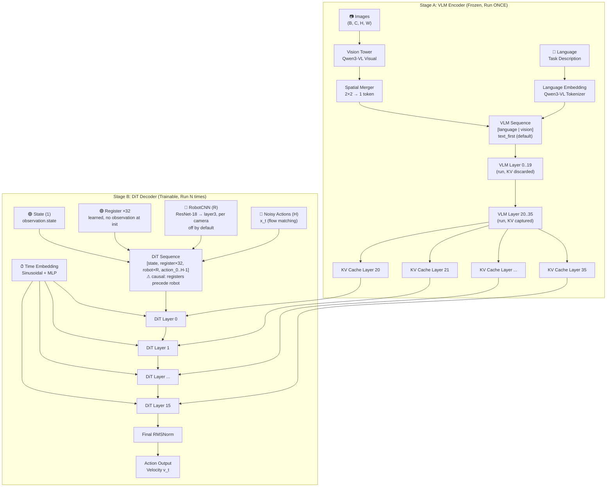

# WiltechsVLA Architecture

## Overview

WiltechsVLA is a **Qwen3-VL-based encoder-decoder flow matching policy** following the Xiaomi-Robotics-0 / pi0-style Mixture-of-Transformers (MoT) architecture. It uses a **frozen Qwen3-VL-4B** as the vision-language encoder and a **trainable DiT (Diffusion Transformer) decoder** for action prediction.

---

## High-Level Architecture


```mermaid
graph TB
    subgraph "Stage A: VLM Encoder (Frozen, Run ONCE)"
        Images["📷 Images<br/>(B, C, H, W)"]
        Language["📝 Language<br/>Task Description"]
        
        VisionTower["Vision Tower<br/>Qwen3-VL Visual"]
        SpatialMerger["Spatial Merger<br/>2×2 → 1 token"]
        LangEmbed["Language Embedding<br/>Qwen3-VL Tokenizer"]
        
        VLMSeq["VLM Sequence<br/>[language | vision]<br/>text_first (default)"]
        
        VLM1["VLM Layer 0..19<br/>(run, KV discarded)"]
        VLMN["VLM Layer 20..35<br/>(run, KV captured)"]

        KV0["KV Cache Layer 20"]
        KV1["KV Cache Layer 21"]
        KV2["KV Cache Layer ..."]
        KV3["KV Cache Layer 35"]
    end
    
    subgraph "Stage B: DiT Decoder (Trainable, Run N times)"
        State["🟢 State (1)<br/>observation.state"]
        Register["🟣 Register ×32<br/>learned, no observation at init"]
        RobotCNN["🤖 RobotCNN (R)<br/>ResNet-18 → layer3, per camera<br/>off by default"]
        Action["🔴 Noisy Actions (H)<br/>x_t (flow matching)"]

        DiTSeq["DiT Sequence<br/>[state, register×32, robot×R, action_0..H-1]<br/>⚠ causal: registers precede robot"]
        
        Time["⏱ Time Embedding<br/>Sinusoidal + MLP"]
        
        DiT1["DiT Layer 0"]
        DiT2["DiT Layer 1"]
        DiT3["DiT Layer ..."]
        DiTN["DiT Layer 15"]
        
        FinalNorm["Final RMSNorm"]
        ActionOut["Action Output<br/>Velocity v_t"]
    end
    
    Images --> VisionTower --> SpatialMerger --> VLMSeq
    Language --> LangEmbed --> VLMSeq
    
    VLMSeq --> VLM1 --> VLMN
    VLMN --> KV0 & KV1 & KV2 & KV3

    State --> DiTSeq
    Register --> DiTSeq
    RobotCNN --> DiTSeq
    Action --> DiTSeq
    
    Time --> DiT1 & DiT2 & DiT3 & DiTN
    DiTSeq --> DiT1 --> DiT2 --> DiT3 --> DiTN
    KV0 --> DiT1
    KV1 --> DiT2
    KV2 --> DiT3
    KV3 --> DiTN
    
    DiTN --> FinalNorm --> ActionOut
```

> **Both optional visual paths are OFF by default.** The Robot CNN
> (`use_robot_cnn`) and the latent Q-Former (`num_latent_tokens`) still exist and
> still slot into the sequence between the registers and the actions when
> enabled — see [Input Tokens](#3-input-tokens). With both off, the frozen VLM's
> ~32 px/token grid is the only visual input anywhere in the model.

---

## Detailed Data Flow

```
┌─────────────────────────────────────────────────────────────────────────┐
│                        INPUT BATCH                                     │
│  ┌──────────────┐  ┌──────────────────┐  ┌──────────────────────────┐  │
│  │ Images       │  │ Task Description │  │ observation.state        │  │
│  │ (B,C,H,W)    │  │ (text string)    │  │ (B, state_dim)           │  │
│  │ per camera   │  │                  │  │                          │  │
│  └──────┬───────┘  └────────┬─────────┘  └───────────┬──────────────┘  │
└─────────┼───────────────────┼────────────────────────┼─────────────────┘
          │                   │                        │
          ▼                   ▼                        ▼
┌─────────────────────────────────────────────────────────────────────────┐
│              STAGE A: VLM ENCODER (FROZEN, @torch.no_grad)             │
│                    Run ONCE per inference step                          │
│                                                                         │
│  ┌─────────────────────┐     ┌─────────────────────┐                   │
│  │  Vision Tower       │     │  Language Embedding │                   │
│  │  Qwen3-VL Visual    │     │  Tokenizer + Embed  │                   │
│  │  → spatial merger   │     │  (max 128 tokens)   │                   │
│  └──────────┬──────────┘     └──────────┬──────────┘                   │
│             │                           │                               │
│             └───────────┬───────────────┘                               │
│                         ▼                                               │
│              ┌─────────────────────┐                                    │
│              │  VLM Sequence       │                                    │
│              │  [language | vision]│  ← text_first (default)            │
│              │  (B, L_vlm, 2560)   │                                    │
│              └──────────┬──────────┘                                    │
│                         │                                               │
│  ┌──────────────────────────────────────────────────────────┐          │
│  │  Qwen3-VL Text Layers (ALL 36 layers, frozen)            │          │
│  │                                                           │          │
│  │  Layer 0 → ... → Layer 19 → Layer 20 → ... → Layer 35    │          │
│  │                                 │                  │      │          │
│  │      (KV discarded)             ▼                  ▼      │          │
│  │     Capture KV from self.capture_layers                   │          │
│  │     vlm_capture_mode="last" (default): the deepest 16     │          │
│  │       → VLM 20..35, one per DiT layer                     │          │
│  │     vlm_capture_mode="spread": np.linspace over 0..35     │          │
│  │                                                           │          │
│  │     KV Cache: [(K_20,V_20), (K_21,V_21), ..., (K_35,V_35)]│          │
│  │     Each: (B, num_kv_heads, L_vlm, head_dim)              │          │
│  │     K is post-M-RoPE rotation                              │         │
│  └───────────────────────────────────────────────────────────┘          │
│                         │                                               │
│                         ▼                                               │
│              ┌─────────────────────┐                                    │
│              │  vlm_kv_pad_mask    │                                    │
│              │  (B, L_vlm) bool    │                                    │
│              │  True = valid pos   │                                    │
│              └─────────────────────┘                                    │
└─────────────────────────┬───────────────────────────────────────────────┘
                          │
                          ▼
┌─────────────────────────────────────────────────────────────────────────┐
│              STAGE B: DiT DECODER (TRAINABLE)                          │
│              Run num_inference_steps times (default: 5)                 │
│                                                                         │
│  ┌──────────────────────────────────────────────────────────────┐      │
│  │  DiT Input Assembly                                         │      │
│  │                                                              │      │
│  │   pos 0        1 .. 32       33 .. 32+R        L-H .. L-1   │      │
│  │  ┌───────┐  ┌───────────┐  ┌──────────────┐   ┌─────────┐  │      │
│  │  │ State │  │ Register  │  │   RobotCNN   │   │ Action  │  │      │
│  │  │  (1)  │  │ (32 toks) │  │ (R, per cam) │   │   (H)   │  │      │
│  │  └───┬───┘  └─────┬─────┘  └──────┬───────┘   └────┬────┘  │      │
│  │      └────────────┴───────────────┴────────────────┘       │      │
│  │        (optional latents, if enabled, sit between          │      │
│  │         RobotCNN and Action)                               │      │
│  │                         │                                    │      │
│  │              ┌──────────▼──────────┐                         │      │
│  │              │  DiT Sequence       │                         │      │
│  │              │  (B, L_dit, H_dit)  │                         │      │
│  │              └─────────────────────┘                         │      │
│  └──────────────────────────────────────────────────────────────┘      │
│                                                                         │
│  ┌──────────────────────────────────────────────────────────────┐      │
│  │  Time Embedding                                              │      │
│  │  t → Sinusoidal(dit_hidden) → MLP → t_emb (B, dit_hidden)   │      │
│  │  → fed to every DiT layer's adaLN-Zero                       │      │
│  └──────────────────────────────────────────────────────────────┘      │
│                                                                         │
│  ┌──────────────────────────────────────────────────────────────┐      │
│  │  DiT Layer i (repeated num_dit_layers times)                │      │
│  │                                                              │      │
│  │  Input: x (B, L_dit, H_dit)                                 │      │
│  │                                                              │      │
│  │  ┌─────────────────────────────────────────────────────┐    │      │
│  │  │  1. Self-Attention (causal mask over DiT sequence)  │    │      │
│  │  │     h = _modulate(sa_norm(x), shift_sa, scale_sa)   │    │      │
│  │  │     Q,K,V = sa_q(h), sa_k(h), sa_v(h)               │    │      │
│  │  │     sa = SDPA(Q, K, V, causal_mask)                 │    │      │
│  │  │     x = x + gate_sa * sa_o(sa)                      │    │      │
│  │  └─────────────────────────────────────────────────────┘    │      │
│  │                         │                                    │      │
│  │  ┌─────────────────────────────────────────────────────┐    │      │
│  │  │  2. Cross-Attention (to VLM KV cache layer i)       │    │      │
│  │  │     h = _modulate(ca_norm(x), shift_ca, scale_ca)   │    │      │
│  │  │     Q = ca_q(h)  [projects DiT→VLM head dim]        │    │      │
│  │  │     K,V = kv_cache[i]  [frozen VLM]                 │    │      │
│  │  │     ca = SDPA(Q, K, V, pad_mask)                    │    │      │
│  │  │     x = x + gate_ca * ca_o(ca)                      │    │      │
│  │  └─────────────────────────────────────────────────────┘    │      │
│  │                         │                                    │      │
│  │  ┌─────────────────────────────────────────────────────┐    │      │
│  │  │  3. FFN (SwiGLU)                                    │    │      │
│  │  │     h = _modulate(ffn_norm(x), shift_ff, scale_ff)  │    │      │
│  │  │     ff = SwiGLU(h)                                  │    │      │
│  │  │     x = x + gate_ff * ff                            │    │      │
│  │  └─────────────────────────────────────────────────────┘    │      │
│  │                         │                                    │      │
│  │  adaLN-Zero: t_emb → SiLU → Linear(9*H) →                  │      │
│  │              {shift, scale, gate} × 3 sublayers             │      │
│  └──────────────────────────────────────────────────────────────┘      │
│                         │                                               │
│              ┌──────────▼──────────┐                                    │
│              │  Final RMSNorm      │                                    │
│              │  (on action slice)  │                                    │
│              └──────────┬──────────┘                                    │
│                         │                                               │
│              ┌──────────▼──────────┐                                    │
│              │  Action Out Proj    │                                    │
│              │  Linear(H→action_dim)│                                   │
│              │  (zero-init)        │                                    │
│              └──────────┬──────────┘                                    │
│                         │                                               │
│                         ▼                                               │
│              ┌─────────────────────┐                                    │
│              │  Velocity v_t       │                                    │
│              │  (B, H, action_dim) │                                    │
│              └─────────────────────┘                                    │
└─────────────────────────────────────────────────────────────────────────┘
```

---

## Key Components

### 1. VLM Encoder (Frozen)

| Component | Details |
|-----------|---------|
| **Model** | Qwen3-VL-4B-Instruct |
| **Layers** | All 36 text layers (no truncation) |
| **Hidden Size** | 2560 |
| **Attention Heads** | 32 heads, **8 KV heads** (GQA, ratio 4:1) |
| **Head Dim** | **128** (2560 / 32 = 80 is wrong; Qwen3-VL uses explicit head_dim=128) |
| **Intermediate FFN** | 9728 |
| **Vision** | Dynamic resolution, spatial_merge_size=2 |
| **Position Encoding** | M-RoPE (3D: t, h, w for vision; monotonic for language) |
| **Sequence Order** | `[language, vision]` by default (`text_first`). The VLM is causal, so this is what makes the captured vision K/V language-conditioned; `--text_last` restores the legacy language-blind layout |
| **KV Capture** | `self.capture_layers`, chosen by `vlm_capture_mode` — `"last"` (default) takes the deepest `num_dit_layers` (16 → VLM 20-35); `"spread"` spaces them over the full depth. `vlm_capture_layers` overrides both |
| **KV Geometry** | Each KV: (B, 8, L_vlm, 128) — 8 KV heads, head_dim 128 |

> **`"last"` vs `"spread"` is a real trade, not a preference.** All 36 layers run
> either way, so `"last"` computes layers 0-19 and throws their KV away. What it
> buys is that every DiT layer reads a representation that has already been
> through 20 layers of vision-language fusion, where the referring expression is
> resolved. What it costs is the shallow, geometric layers — which is what a DiT
> layer needs if its job is precise placement rather than object selection.
>
> Measured on the MoE variant, cross-attention language share runs **~44% at VLM
> layer 8 against ~91% at layer 35**. Under `text_first` the language K/V cannot
> see the image at all (the instruction precedes it under a causal mask), so a
> pure-tail DiT spends most of its cross-attention on image-independent content.

### 2. DiT Decoder (Trainable)

| Component | Details |
|-----------|---------|
| **Layers** | `num_dit_layers` (default: **16**, one per captured VLM layer) |
| **Hidden Size** | `dit_hidden_size` — decoupled from VLM's 2560 for param savings (640 matches WiltechsMoE) |
| **Self-Attention** | `dit_hidden/128` heads × 128 dim, GQA at the VLM's 4:1 ratio, causal mask over full DiT sequence |
| **Cross-Attention** | **32 heads × 128 dim**, 8 KV heads (matches VLM KV geometry); Q from DiT, K/V from VLM cache (no RoPE on Q) |
| **FFN** | SwiGLU, intermediate = `dit_hidden` (matches WiltechsMoE). Before 2026-08-04 this scaled the VLM's 9728 by `dit_hidden/2560`, ~4× wider |
| **Modulation** | adaLN-Zero with 9 vectors per layer (3 sublayers × {shift, scale, gate}) |
| **Time Embedding** | Sinusoidal(dit_hidden) → MLP(SiLU, hidden→hidden→hidden) → per-layer adaLN |
| **Gradient Checkpointing** | Optional — recomputes DiT layer activations in backward (saves ~5-10× activation memory) |

### 3. Input Tokens

Sequence order: `[state(1), register(32), (robot)?, (latent)?, action(H)]`

| Token | Source | Shape | Default | Notes |
|-------|--------|-------|---------|-------|
| **State** | observation.state | (1, H) | on | Linear + RMSNorm, last obs step. **First**, so every later token can read it under the causal mask |
| **Register** | Learnable | (32, H) | **32** | `num_register_tokens`. std=0.02 init. Sits **before** the robot tokens, so it cannot see them |
| **Robot CNN** | RobotVisualEncoder | (per_cam × tokens, H) | **off** | `use_robot_cnn`. Granularity is `robot_encoder_input_size / sqrt(robot_encoder_tokens)` px/token — the defaults 224/16 give **56**, coarser than the VLM's 32, which defeats the purpose. 224/64 = 28 or 256/100 = 25.6 |
| **Latents** | LatentQFormer | (num_latent_tokens, H) | **0 (off)** | Learned queries cross-attend the top VLM KV layer; zero-init gates |
| **Actions** | noisy actions x_t | (horizon, H) | on | action_in_proj + action_pos_emb — the **only** positional signal in the DiT |

**Registers are not the latent Q-Former's tokens.** The latents are computed
once, outside the stack, from a single VLM layer, and arrive already fixed. The
registers start as pure parameters holding no observation at all and are
rewritten at *every* DiT layer: they take part in self-attention, and since
cross-attention carries no causal mask and covers all DiT positions, they
cross-attend to the VLM in each layer too. They are a scratchpad the stack
writes to across depth, not a summary handed to it.

They reach the actions only through causal self-attention, which they precede,
so every action token can read all 32.

Init is `std=0.02`, not zero: outside the action slice the DiT has no positional
embedding, so identical registers would be indistinguishable to self-attention
and could never differentiate.

> The **SINK** token was removed. It held position 0 as a no-op attention target
> and carried no capacity, so `state` could not be first while it existed.

### 4. Flow Matching

| Component | Details |
|-----------|---------|
| **Noise** | Gaussian, optional AR(1) temporal correlation |
| **Time Sampling** | Uniform [0.001, 0.999] |
| **Interpolation** | x_t = t·noise + (1-t)·action |
| **Target** | u_t = noise - action (velocity) |
| **Inference** | Euler integration, N=5 steps |

### 5. Contrastive Loss (Optional)

| Component | Details |
|-----------|---------|
| **Method** | Permute language KV across batch |
| **Margin** | Hinge on MSE(v_t, v_wrong) ≥ contrastive_margin |
| **Weight** | contrastive_loss_weight (default: 0.1) |
| **Savings** | No second VLM forward — only re-runs DiT |

---

## Attention Mask Structure

### DiT Self-Attention (Full Causal)

Sequence order is fixed in `_build_dit_input`:
`[state(1), register(32), robot(R), latent(K), action(H)]`

```
Position:  State  Reg_0 .. Reg_31  Rob_0 .. Rob_R  Act_0  Act_1 .. Act_H-1
State        ✓      -        -       -       -       -      -         -
Reg_0        ✓      ✓        -       -       -       -      -         -
Reg_31       ✓      ✓        ✓       -       -       -      -         -   ← blind to robot
Rob_0        ✓      ✓        ✓       ✓       -       -      -         -
Rob_R        ✓      ✓        ✓       ✓       ✓       -      -         -
Act_0        ✓      ✓        ✓       ✓       ✓       ✓      -         -
Act_1        ✓      ✓        ✓       ✓       ✓       ✓      ✓         -
Act_H-1      ✓      ✓        ✓       ✓       ✓       ✓      ✓         ✓
```

> ### The registers sit BEFORE the RobotCNN, so they cannot read it
>
> Under this mask no register attends to any robot token. Whatever the registers
> accumulate is built from the state and from cross-attention to the VLM only —
> the fine visual detail the RobotCNN exists to supply never reaches them.
>
> The action tokens see both, so the information does arrive; but the registers
> take a large share of action self-attention (25.8% measured with the RobotCNN
> on, 38.2% without), and that share is computed blind to the pixels.
>
> If the registers are meant to be a scratchpad that integrates *everything*
> before handing off to the actions, the fix is to put the robot tokens ahead of
> them — `[state, robot, register, action]` — which costs nothing and is a
> one-line reorder in `_build_dit_input`. Left as-is deliberately for now: it is
> a live variable, not a settled choice.

The registers are also **causal among themselves** — `Reg_0` cannot see
`Reg_31`. Only the last register sees the whole block. If they are meant to be
jointly addressable rather than left-to-right, this mask is the thing to change;
nothing else in the model assumes register causality.

Lengths: `L_dit = 1 + 32 + R + K + H`. With `horizon=64`, registers 32, latents
off: **97** with no RobotCNN, **129** with 2 cameras × 16 tokens, **197** with a
wrist-only 100-token grid.

### DiT Cross-Attention (to VLM KV)

```
DiT Query → VLM Key/Value (all VLM positions visible, padding masked)

Each DiT position can attend to ALL valid VLM positions:
  [vision_0, vision_1, ..., vision_N, lang_0, lang_1, ..., lang_M]
  ↑_____________valid_______________↑  ↑________valid________↑
                                     ↑_____padded (masked)_____↑
```

---

## Parameter Count Summary

The DiT stack dominates, and its size is set by three knobs: `num_dit_layers`,
`dit_hidden_size`, and the FFN width (now `= dit_hidden`). Per-layer cost is

```
self-attn  h·(sa_nh + 2·sa_nkv + sa_nh)·128     cross-attn  2·h·32·128
FFN        3·h·intermediate  (SwiGLU)            adaLN       9·h²
```

| Config | Per layer | DiT total |
|--------|-----------|-----------|
| 16L @ 1280, FFN 4864 (pre-2026-08-04 default) | 47.9M | 766M |
| **16L @ 1280, FFN 1280 (current default depth)** | 34.1M | **546M** |
| 16L @ 640, FFN 640 | 11.1M | 178M |
| 36L @ 640, FFN 640 | 11.1M | 401M |
| 36L @ 1280, FFN 1280 | 34.1M | 1227M |
| 16L @ 2560, FFN **9728** | 180.9M | **2895M** |

> The last row is not a typo. When `dit_hidden_size` equals the VLM's 2560 the
> model takes the full-width branch, where the FFN inherits the VLM's
> `intermediate_size` of **9728** rather than `dit_hidden` — so leaving
> `--dit_hidden_size` at its default 0 gives a **2.89B** DiT, 5.3× the 1280 row.
> Confirmed against a run's own report (`Time Embedder` 13,112,320 = 2(h²+h) at
> h=2560; `DiT Layers` 2,894,561,280 = 16 × 180,910,080).

> `num_dit_layers` dropped 36 → 16, so at a fixed width the stack is **44%** of
> its former size. `dit_hidden_size` is the other lever and it is quadratic:
> 16L @ 1280 is 3.1× 16L @ 640.

> **To compare against WiltechsMoE, match the WIDTH, not just the layer count.**
> The MoE's 92% checkpoint runs `dit_hidden=1280` — 4 experts × 9 layers at
> 34.1M/layer = **1,227,386,880** expert params (confirmed three ways from its
> training log: expert total, `Sink Token` = 1280, `Time Embedder` = 3,279,360).
> The layer counts match at 36, but `36L @ 640` is **1/3 the parameters**, not
> parity. An earlier note here claimed otherwise; it had been derived from the
> MoE config's *default* 640 rather than from what the run actually used, and a
> VLA run at 640 scored 25% against the MoE's 92% with three variables
> confounded (width, gradient-update count, topology). Use
> `--dit_hidden_size 1280` for a controlled comparison.

Non-DiT components at `dit_hidden=1280`: register tokens 41K, state encoder 10K,
action in/out ~5K each, action pos emb 82K, time embedder 3.3M. Off by default:
Robot CNN ~5M, latent Q-Former ~17M. (At 640, halve the linear terms and quarter
the time embedder.)

> **Calibration**: the formula above reproduces the one measured figure on
> record — 16L @ 1280 predicts 766M against a reported 803,033,675 total
> trainable, the ~37M difference being the non-DiT components. The other rows
> are computed, not measured; the runtime `trainable params` print is
> authoritative.

---

## Key Design Decisions

1. **VLM runs once per inference** — 10× speedup vs interleaved at N=10 denoising steps
2. **All 36 VLM layers run; the deepest 16 are captured** — `vlm_capture_mode="last"`. Layers 0-19 are computed and discarded; see the trade above
3. **State first, then 32 registers, then actions** — the only ordering where the registers can read the state and every action can read the registers
4. **No RoPE on DiT cross-attention Q** — VLM K already carries M-RoPE rotation
5. **adaLN-Zero zero-init** — gates start at 0, each block acts as identity at init
6. **Output projection zero-init** — prevents dead-init deadlock with adaLN gates
7. **Cross-attention Q comes from the residual stream, not the self-attn output** — it reads `x + gate_sa · sa`, and at init `gate_sa = 0`, so CA sees the layer input unchanged

---

## Known Asymmetries

**Cross-attention K is rotated, Q is not.** `_run_vlm_and_cache_kv` applies RoPE
before caching, so the VLM keys carry absolute M-RoPE phase while `ca_q`'s output
carries none — the DiT query is not part of the VLM sequence and has no position
to encode. In ordinary RoPE attention both sides rotate and only *relative*
position survives the dot product; here the query faces absolute phase.

This matters because `_build_mrope_position_ids` offsets the image block by the
text length, and that length is the **padded max instruction length in the
batch** — so the vision keys' phase shifts from batch to batch. The code comment
calling this offset "harmless under RoPE" is correct for the VLM's own
self-attention and *not* for this cross-attention.

Not fatal (models train, vision cross-attention share stays healthy), but it is a
noise source the model has to average over. Cheap to test: pad the language to a
fixed length (`padding="max_length"`) so the vision block starts at a constant
position, then compare the vision cross-attention share and val loss.

**Cross-attention is ~31% of the DiT's parameters.** `ca_q` and `ca_o` must
bridge `dit_hidden` to the VLM's 32×128 = 4096 head geometry, because the K/V are
the VLM's own projections and there is no `k_proj`/`v_proj` to meet them halfway.
At `dit_hidden=1280` that is 2 × 1280 × 4096 = 10.5M of the 34.1M per layer.
6. **Gradient checkpointing** — optional, recomputes DiT activations in backward